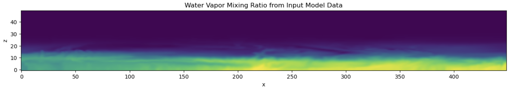
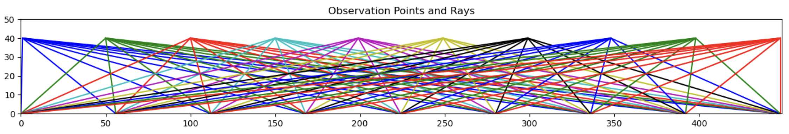
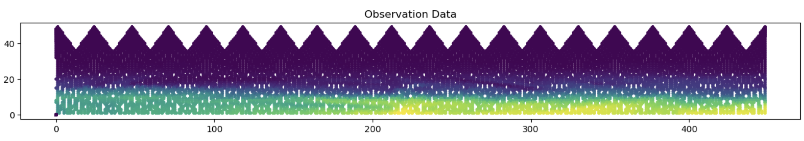

# Water Vapor Reconstruction

Exploring the accurate generation of 3D water vapor fields through the
integration of line data obtained from overhead sensors.


## Process

### Mimicking Input Data
The input data will be analogous to taking the line integral of water vapor
along a ray projecting downward from an observational point above.
Representing a plane flying over a region collecting data from below.

* Water vapor from model input data to mimic environment.


* Subset of observation points and ray paths.


* Subset of collected observation data along ray paths.


* Integrate along each ray path


### Reconstruction
- Given a set number of observation points and rays, gather initial
  1-dimensional array of line integrals from the environment. This represents
  the experimential input data.
- Generate randomized "guess" array and calculate line integrals following the
  same set of observation points and rays as the previous step.
- Minimize the difference between the environmental line integrals and the
  randomized line integrals using the SciPy Optimize minimize function until
  the randomized "guess" array represents the true environment.

## Python Tool
### Line Integrals from Enviroment
```python
# setup input arguments
rv_data = xr.open_mfdataset('input_data/qvapor.nc', combine='by_coords')
num_observations=100
num_rays=20
observation_height = len(rv_data.bottom_top) * 0.8

# create object
rv = RiceVapor(rv_data, num_obs=num_observations, z=observation_height)
rv.set_num_rays(num_rays)

# compute line integrals
rv.compute_obs()
```

### Minimization of initial randomized array
The tool's minimization of initial randomized array process uses the [SciPy Optimization](https://docs.scipy.org/doc/scipy/reference/optimize.html)
package's [minimize](https://docs.scipy.org/doc/scipy/reference/generated/scipy.optimize.minimize.html)
function.
The minimize function reduces the difference between the line integral's of
the environmental data and a randomized arrays.
The randomized array uses the save observation points and rays as the
environmental setup.
As the randomized line integral output approaches the environmental's line
integral, the theory is that the randomized array will now closely represent
the environment's water vapor field.

#### Minimization Steps
* Coarsen environment and guess array
* Compute line integrals
* Find the error: note the *n*th `envLineIntegral` and `guessLineIntegral` are
the line integral for the *n*th observation point. `envMean` and `guessMean`
are one-dimensional arrays the size of the number of rays.
```math
\begin{align}
envMean=\frac{1}{n} \sum_{n=1}^{numObs} envLineIntegral_n \\
guessMean=\frac{1}{n} \sum_{n=1}^{numObs} guessLineIntegral_n \\
\frac{1}{n} \sum_{n=1}^{numObs}(envMean-guessMean)^2
\end{align}
```


* The `optimize.minimize` method will use different variations of the guess
  array to miminize the error difference between the guess and the
  environment.

## Testing
The [example.ipynb](tests/example.ipynb) Jupyterhub Notebook can be found
under the `tests` directory.
